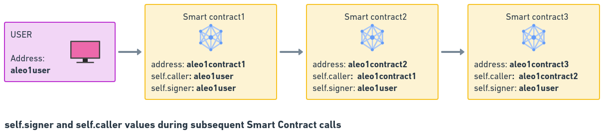
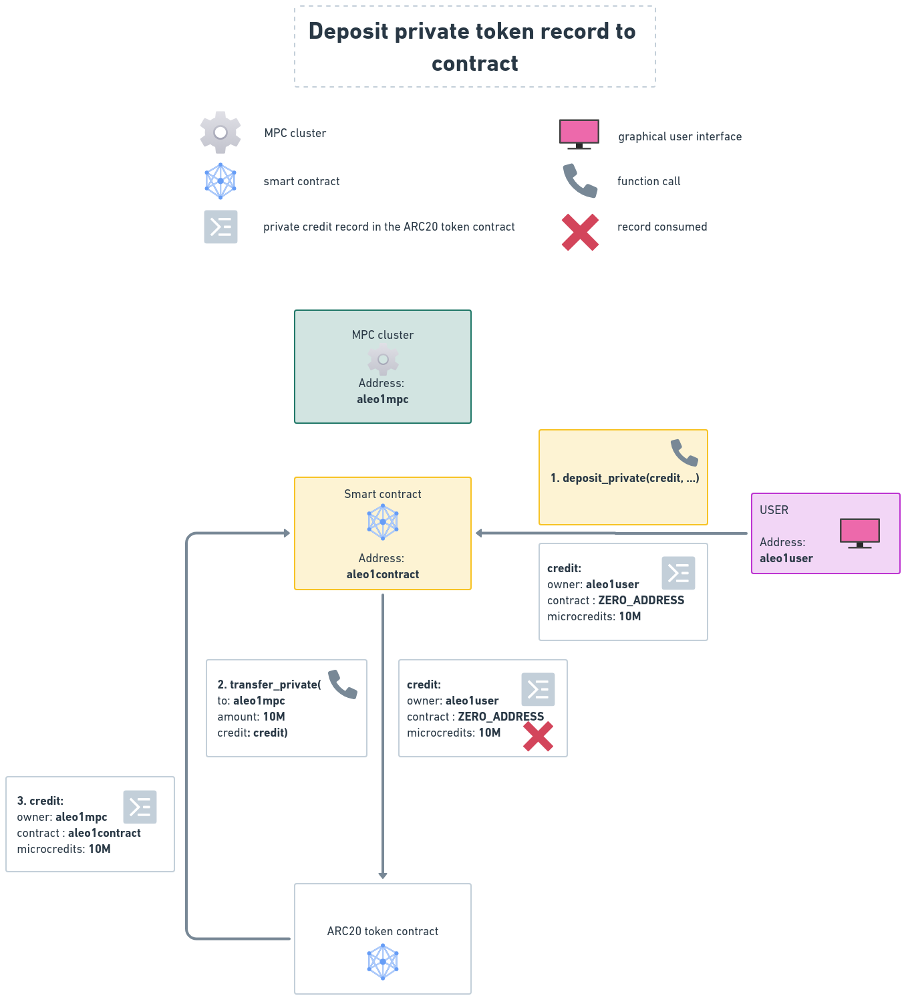

## 1. Abstract

There are several ARC-20 implementation standard proposals for the Aleo blockchain. The current ideas try are based on the already successful Ethereum ERC-20 standard. We would like to point out two issues with the present solutions that should be altered namely:
1. Replaced onchain `approve()` functionality with [offchain signature](#tp) - `approve()` transition should not be implemented, instead user can agree to send token to a contract offchain using an offchain signature process to approve a transaction, and an onchain function eg [`transfer_from_public()`](#tp) that can apply that signature. This way smart contract interaction does not have to be a two step, but rather a one step process. This solution will save system resources as the approve part is offchain rather than onchain.
2. Enable [private token records to be sent to smart contracts](#deposit-private) - This problem must be addressed because one of the key selling points of Aleo is its programmable privacy. The author of this ARC also believes that to utilize the UTXO nature of Token records also leads to a much larger scalability than that can be achieved applying mappings and public tokens.
3. A signature scheme that [connects the contract with the main website](#company-signature) of the project. Thus make it easier for users to trust the token contract, and decrease the possibility of phishing attacks.

By applying the proposals pointed out in this ARC the token standard will be more usable because of:
1. one step approval process applying off chain signature, instead of two steps of `approve()` and `transfer_from()`, and 
2. the ability to send private tokens to smart contracts will enable a thriving DeFi life on top of the Aleo network.
3. make token contracts more secure by connecting them to the company website with a digital signature.


<!-- If someone only reads this far, what do you want them to know? -->


## 2. Specification

### 2.1. Terminology

#### 2.1.1. Offline signature

In recent days Aleo has introduced signature verification in the snarkVM. This means that a user can sign a message offline, and then the signature can be verified onchain. This is a very important feature as it enables the user to sign a message offline, and then send the signature to the blockchain.  The signature verification is done by the snarkVM, and the signature is verified by the `signature::verify(s: signature, from: address, field_hash: field)` function. This way user can pre sign the transaction of allowing a certain amount of tokens to be transferred from his/her account to aan address.

#### 2.1.2. MUST BE IMPLEMENTED

If a feature is termed "MUST BE IMPLEMENTED" then it means that the feature is mandatory to be implemented to comply to this ARC. 

#### 2.1.3. MUST NOT BE IMPLEMENTED

If a feature is termed "MUST NOT BE IMPLEMENTED" then it means that the feature must NOT be implemented to comply to this ARC. Implementing this feature will lead to non-compliance to this ARC.

An implementation of the feature can lead to immediate token loss for users.

#### 2.1.4. SHOULD BE IMPLEMENTED

If a feature is termed "SHOULD BE IMPLEMENTED" then it means that the feature is not mandatory to be implemented to comply to this ARC, but it is highly recommended to be implemented. 

#### 2.1.5. NOT NEEDED

If a feature is termed "NOT NEEDED" then it means that current ARC defines an alternative way of achieving the same functionality. 

#### 2.1.6. NOT IMPLEMENTABLE

If a feature is termed "NOT IMPLEMENTABLE" then it means that current implementation of snarkVM does not make it possible to implement the certain feature. 

#### 2.1.7. MUST BE

If a feature is termed "MUST BE" then it means that the feature is mandatory to be implemented accordingly to comply to this ARC. 

#### 2.1.8. MUST HAVE

If a feature is termed "MUST HAVE" then it means that the feature must contain something exactly the way it was defined after "MUST HAVE" was used to comply to this ARC. 

#### 2.1.9. MUST

Whatever follows MUST that must be implemented exactly as it was defined after "MUST" to comply with this ARC.

<a name="zero_address"></a>
#### 2.1.10. ZERO_ADDRESS

```leo
const ZERO_ADDRESS: address = aleo1yr9ls3d7cn2x2sr359kqq7vjkwnzr4x0e24ju6ysj2pte4c99c8qx0rwwl;
assert_eq(ZERO_ADDRESS, BHP256::hash_to_address(0group));
```

Because Aleo as at the time of the writing of this ARC does not have the Rust functionality of [Option](https://doc.rust-lang.org/std/option/) `None`, we must introduce an address that will be treated as `ZERO_ADDRESS` is the address that is created by applying `BHP256::hash_to_address(0group)`. The function of this address is that system takes it as if no address was provided at all.

Because of hashing applied the way above, the chance of an account will have the same address as `ZERO_ADDRESS` is negligible. 


<a name="mpc"></a>
#### 2.1.11. MPC (Multi Party Computation)

[Multi Party Computation](https://coinmarketcap.com/academy/article/what-are-multi-party-computation-mpc-wallets) is a decentralized solution of storing a private key in a federated way thus making it impossible for any party (even the ones that are part of the MPC) to have access to the private key.  It can be used to create wallets that can be used to store private keys for contracts. The MPC MUST HAVE the following features:
1. The private key MUST be used to sign transactions, but  MUST NOT be possible to reconstruct the private key for any parties in the MPC or outside the MPC.
2. MPC MUST BE scalable. (As the number of parties constituting the MPC is not limited, and also multiple MPC clusters can be used to store the same private key and sign transactions parallelly, this is perfectly possible). 
3. MPC implementation MUST HAVE no way to handle users' funds any other way other than that set out by the smart contracts.
4. MPC MUST store all the secret data in encrypted form. This way even if the parts of the MPC cluster is compromised, the data will be useless for the attacker.
5. Compliance SHOULD BE implemented in the MPC system. This way authorities can request the MPC cluster to reveal a subset of data predefined by smart contracts.

<a name="si"></a>
#### 2.1.12. `self.signer`

The account address whose private key is used to sign the transaction and decode encrypted records, is called `self.signer`. `self.signer` is always an account address. (As long as federated signature scheme is not introduced in Aleo).



See [Aleo documentation](https://developer.aleo.org/leo/language#selfcaller) for details.

<a name="sc"></a>
#### 2.1.13. `self.caller`

The address of an account or a contract that called the transition is called `self.caller`. See figure above for details. 

See [Aleo documentation](https://developer.aleo.org/leo/language#selfcaller) for details.

### 2.2. Specification 

In this session the transitions, constants, and mappings are defined. Wherever name is specified for a transition, constant, or mapping, it is mandatory to use the specific name and the specific type(s) specified in this ARC. 

#### 2.2.1. Name of token - MUST BE IMPLEMENTED
TODO: find out type

`const name : u128`: the name of the token. Eg: "Aleo Credits"  

A unicode string of byte length of 16. The left most character of string should be the highest byte of the `u128` number. As an example "Aleo Credits" must be encoded as follows: `0x416C656F206372656469747300000000  = 86962645114461045215243575462861996032u128`. If `string` type is included in Aleo specification, this ARC must be updated.

#### 2.2.2. Symbol of token - MUST BE IMPLEMENTED

TODO: find out type

`const symbol : u128`: the symbol of the token. Eg: "ALEO"  

A unicode string of byte length of 16. The left most character of string should be the highest byte of the `u128` number. As an example "ALEO" should be encoded as follows: `0x414C454F000000000000000000000000 = 86795840032555669230657698889553936384u128`. If `string` type is included in Aleo specification, this ARC must be updated.

<a name="company-signature"></a>
#### 2.2.3. Company signature - MUST BE IMPLEMENTED

##### 2.2.3.1 Rationale for company signature

Idea this that Companies that create smart contracts must be able to have a standardized mechanism to connect their contracts to their website. This can be done by createing a standardized URL: CAU - Company Addresses URL, that MUST return the JSON array of signer addresses and corresponding CAU signatures of the company. On the smart contract side all contracts MUST HAVE a constant called `company_signature` that MUST BE the signature of the contract name created by the private key of the signer address. This way users can check if the contract is belonging to the Company.

Blockhain explorers can utilize this feature to display the website that the contract belongs to. Explorers can request the [CAU](#cau) URL from developer, when the contract is verified, and then display the website of the company to the users. This way users can be sure that the contract is indeed belonging to the certain company.

<a name="csc"></a>
##### 2.2.3.2 Company signature constant - MUST BE IMPLEMENTED

```leo
constant company_signature: signature = sign<signature>;
```

`signature` must be created by Aleo signing scheme the following way:

`signature = aleo::sign_message(<program_name>, pk)`: where 
1. `aleo::sign_message` is the [message signing scheme](https://developer.aleo.org/aleo/language/#signatures) of Aleo.
2. `<program_name>` is the name of the ARC20 token. Eg: "ARC20_0001.aleo". The extension of the program name MUST BE ".aleo".
3. `pk` is the private key of the `account_address` of company. 


<a name="cau"></a>
##### 2.2.3.3 CAU - Company Accounts URL - MUST BE IMPLEMENTED

CAU - Company Accounts URL: `https://<company-domain.com>/aleo_signer_accounts/` 

where `<company-domain.com>` is the domain name of the company. 

This URL called upon by the GET method must return a JSON array of objects each containing 
1. `account`: Aleo address whose private keys are used by company to sign its contracts, and 
2. `cau_signature` a signature that connects the CAU to the `account`.

Example return: 

```json
[
    {
        "account": "aleo1qz34g0zdl0ztlval9vxer75uf2t9q7jgf4g8cuxv5q5c8lz6x5rssucpm5", 
        "cau_signature": "sign01111111111111111111111111111111111111111111111111111111111111111111111111111111111111111111111111111111111111111111111111111111111111111111111111111111111111111111111111111111111111111111111111111111111111111111"
    }, 
    {
        "account": "aleo1yx5aq4tsgvraxu63vtjq5tqefkwcv4pk7yxyc5hswl7jdlktggyqf4a52f"
        "cau_signature": "sign02222222222222222222222222222222222222222222222222222222222222222222222222222222222222222222222222222222222222222222222222222222222222222222222222222222222222222222222222222222222222222222222222222222222222222222"
    },
    {
        "account": "aleo17wmuq5n08vs0tt356uhc6hlljy8c95zteqpa2ne8kcw3sa0rt5yqg7jdys",
        "cau_signature": "sign03333333333333333333333333333333333333333333333333333333333333333333333333333333333333333333333333333333333333333333333333333333333333333333333333333333333333333333333333333333333333333333333333333333333333333333"
    }
]
```
To ensure that a contract is indeed belonging to the company, ALL of the following conditions MUST BE satisfied:

1. Lets assume that from the returned list of accounts an account called `signing_account` does satisfy the following equality:

    `aleo::verify_message(program_name, company_signature, signing_account) == true`: where 
    1. `program_name` is the name of the ARC20 token. Eg: "ARC20_0001.aleo". The extension of the program name MUST BE ".aleo".
    2. [`company_signature`](#csc) is the signature of the `program_name` created by the private key of the `account` address.
    3. `signing_account` is the current address returned by Company Accounts URL. 

    If `signing_account` does indeed satisfy (1.) then there is a mathematical proof that this account indeed has signed the `program_name` program.

2. `cau_signature` belonging to `signing_account` MUST satisfy the `aleo::verify_message(cau, cau_signature, signing_account) == ture` equation, where 
    1. `cau` is the [CAU - Company Accounts URL](#cau).
    2. `cau_signature` is the signature of the CAU created by the private key of the `signing_account` address.
    3. `signing_account` is the `account` that the same as in (1.) above.
`cau_signature` signature ensures that the JSON array of addresses indeed belong to the Company Accounts URL.
    
    If `signing_account` and `cau_signature` do indeed satisfy (2.) then there is a mathematical proof that this account indeed signed the `cau` URL, thus the CAU has legitimately listed the account as its own. This gives protection against sites falsely claiming that `accounts` are theirs.
    
If [`company_signature`](#csc) and none of the returned `account`s and corresponding `cau_signatures` satisfy both (1.) and (2.) then the contract MUST BE considered as not belonging to the company.

IF BOTH (1.) and (2.) are satisfied by [`company_signature`](#csc), `signing_account` and corresponding `cau_signature` then the contract MUST BE considered as belonging to the company.

#### 2.2.4. Approve of tokens - NOT NEEDED

~~`approve(to: address, amount: u64) -> ()`~~ transition is not needed in this design.

Instead of ~~`approve()`~~ transition the [`transfer_from_public()`](#tp) transition should be used. And a signature of that transaction should be created offline beforehand. This setup uses less system resources and thus more scalable then to use ~~`approve()`~~ that would use mappings . 

#### 2.2.5. Allowance of tokens - NOT NEEDED

~~`allowance() -> u64`~~ function is not needed in this design. 

As in the [`transfer_from_public()`](#tp) transition the signature parameter contains the approval. See  [`transfer_from_public()`](#tp) function above.


As in the [`transfer_from_public()`](#tp) transition the signature parameter contains the approval. See  [`transfer_from_public()`](#tp) function above.

#### 2.2.6. Decimals - MUST BE IMPLEMENTED

<a name="decimals"></a>
##### 2.2.6.1. Decimals constant - MUST BE IMPLEMENTED

`const decimals : u8`: constant containing the deimal precision of the current token.

##### 2.2.6.1. Decimals transition - NOT NEEDED
~~`decimals() -> u8`~~: transition returning the decimal precision of the current token.

This transition is not needed as the [`decimals`](#decimals) constant is already defined for the same purpose.

###### Rationale for not having decimals as a transition

As `decimals` is a constant  (see [above](#decimals)), and MUST BE IMPLEMENTED, it is easy to query and provide it as input of any transition necessary. There is no need to implement an extra function for this.

#### 2.2.7. Public balance of account - MUST BE IMPLEMENTED

`mapping account : address => u64`: the public balance of an account. The `address` is the address of the account. The `u64` is the amount of tokens the account has. 

#### 2.2.8 Private token record - MUST BE IMPLEMENTED

<a name="private_records_to_contracts"></a>
##### 2.2.8.1 Rationale of private records being sent to contracts

There are two reasons why private token records should be sent to contracts:
1. To enable private (but compliant) DeFi on Aleo.
2. To enable the scalabiiity of the token system.

Private DeFi is a must have feature for Aleo to be able to compete with other blockchains. 

Scalability can be achived better with records than with mappings. Because with mappings all the validators must rerun the transaction which has `O(n)` difficulty, where `n` is the number of instructions, while with private records it is `O(1)` because all validators have to do is check the validity of a proof. Thus applying records leads to a much more scalable system.  

The easiest implementation of sending private tokens to a smart contract would be to just simply set the `owner` field to that of the destination contract. With currernt setup this is not possible as currently contracts do not have a federated private keys, that would make them possible to encode/decode private record data. So in the optimal solution the contract as an `owner` would have two roles in one:
1. He would be the controller of the record, meaning he could decide what to do with the record.
2. He would be the encoder and decoder of the private data.

Currently (2.) is not possible as contracts do not have a federated private key. So the ownership and the encoding/decoding of private data must be separated. 


This will reflect in the design of the `credits` record. 

##### 2.2.8.2 Design of `credits` record - MUST BE IMPLEMENTED

The `credits` record MUST HAVE three fields instead of just two: 
1. `owner` - private `address`, the owner of the record. This is the account that has the right to encode and decode the private data. If a record is owned by a contract, than this field MUST BE the account address of the MPC cluster that has the federated private key to encode and decode the private data.
2. `contract` - private `address`, the contract that the record is sent to. If the record is sent to an account, then this field MUST BE [`ZERO_ADDRESS`](#zero_address). If the record is sent to a contract, then this field MUST BE the address of the contract. 
3. `microcredits` - private `u64`, the amount of tokens the record contains. This field MUST BE public.

The record MUST HAVE the following definition:
```
record credits {
    owner: address,
    contract: address,
    microcredits: u64
}
```

If the `contract` field is not [`ZERO_ADDRESS`](#zero_address) then the this token contract MUST only accept calls whose [`self.signer`](#si) is the the `credit.owner` and the [`self.caller`](#sc) is the `credit.contract`. This way only `contract` can control the private record, but the MPC as the `owner` can encode and decode the private data. 

#### 2.2.8. Token transfer transitions - MUST BE IMPLEMENTED

Token transfer transitions are the transitions that can be used to transfer tokens from one account to another. There should be six types of token transfer transitions:
1. transfer to same account from public to private and vice versa,
2. that transfers to another account publicly or privately,
3. and two another, that transfers in the name of another account publicly or privately.


<a name="transfer-public-to-private"></a>
##### 2.2.8.1. Transfer public to private - MUST BE IMPLEMENTED

`transfer_public_to_private(to: address, public amount: u64) -> credits`: transfer to `address` from [`self.signer`](#si) an `amount` of tokens. Returns the record of `credits` that is private.  

In case the `amount` is greater than the public balance of [`self.signer`](#si) then the transition MUST fail.

##### 2.2.8.2. Transfer private to public - MUST BE IMPLEMENTED

`transfer_private_to_public(public to: address, public amount: u64, credit: credits) -> credits`: transfer from private record of `credits` to `to` address in a way that his public balance will increase with `amount` and the private balance of `credit` will decrease with `amount`. MUST return the remainder record of `credits` that is private.

In case the `amount` is greater than the private balance of `credit` then the transition MUST fail.

##### 2.2.8.3. Transfer tokens publicly - MUST BE IMPLEMENTED

`transfer_public(public to: address, public amount: u64)`: send from [`self.signer`](#si) (the transition's signer's)  address to `to` address an amount of `amount` of tokens publicly. 

If the `amount` is greater than the public balance of [`self.signer`](#si) then the transition MUST fail.

It MUST be possible to transfer tokens to contracts using this transition.

<a name="tp"></a>
##### 2.2.8.4. Transfer tokens of another account publicly - MUST BE IMPLEMENTED

`transfer_from_public(  
    public to: address,  
    public amount: u64,  
    public from: address,  
    public expire: u32  
    authorization: signature,  
) -> ()`: transfers from `from` address to `to` address an amount of `amount` tokens using the  `authorization` signature previously created by `from` address offline, if the `block.height` is less than `expire`. 

The `authorization` is NOT public, this way it is impossible for third party to replay attack user's tokens. Note: `allowance()` furnction is not needed in this design, as the signature contains the approval. 

It MUST be possible to transfer tokens to contracts using this transition.

##### 2.2.8.6. Transition creating the hash to be signed - SHOULD BE IMPLEMENTED

`hash_to_sign(  
    to: address,  
    amount: u64,  
    from: address,  
    expire: u32  
) -> field`: returns the hash of the data that needs to be signed by `from` address to create the `authorization` signature for [`transfer_from_public()`](#tp). 

All the parameters MUST BE private.  

This transition MUST create the hash that can be used to create the `authorization` signature offchain. 

This transition is used to generate the `signature` parameter for [``transfer_from_public()`](#tp) transition.

This transition is only needed as long as there is no easy alternative offchain solution is found to create the hash.

Contracts MUST NOT rely on the availability of this transition, as it is not mandatory. 

TODO: implement to example

<a name="transfer-private"></a>
##### 2.2.8.6. Transfer tokens privately - MUST BE IMPLEMENTED

`transfer_private(to: address, amount: u64, credit: credits) -> (credits,credits)`: send from [`self.signer`](#si) (the transition's signer's)  address to `to` address an amount of `amount` of tokens of `credit` privately. 

It MUST return a tuple of two records in the order below:
1. Remainder record - the remainder of `credit` that is left for sender after sending `amount` of it to `to` address. It MUST HAVE the following fields set. All of which MUST BE private: 
    1. `owner` private `address`, must be the same as that of the input record `credit`.
    2. `contract`  private `address`, must be the same as that of the input record `credit`.
    3. `microcredits` private `u64`, field MUST BE the remainder of `microcredits` after having spent `amount`;
2. Record sent, with the following fields. All of which MUST BE private:
    1. `owner` private `address`, must be set to `to` address.
    2. `contract` private `address`, if the contract was called 
        1. by an account (`self.caller == self.signer`), then `credit.contract` must be equal to [`ZERO_ADDRESS`](#zero_address) if not transition MUST fail, then [`ZERO_ADDRESS`](#zero_address).
        2. by a contract (`self.caller != self.signer`), then [`self.caller`](#sc)  must be equal to `credit.contract`, or the transaction initiator ([`self.signer`](#si)) must be equal to `credit.owner` and `credit.contract` MUST BE equal to  [`ZERO_ADDRESS`](#zero_address), if not transition MUST fail, then [`self.caller`](#sc).
    3. `microcredits` private `u64`, field MUST BE the amount of `amount` of tokens that was sent.

It MUST be able to transfer tokens to contracts using this transition.

##### 2.2.8.7. Transfer tokens privately with `contract` property - MUST NOT BE IMLMENTED

~~`transfer_private(to: address, amount: u64, contract: address, credit: credits) -> (credits,credits)`~~: This function would enable to send private token record to a Smart Contract with MPC, by directly setting the `to` and `contract` fields of the resulting record.

This transition MUST NOT BE IMPLEMENTED as users CAN confuse the `to` address with `contract` address, and that leads to token loss. While [pocedure 2.3.1](#deposit-private) can do this safely without having to introduce a new transition.

##### 2.2.8.8. Transfer tokens of another account privately - NOT IMPLEMENTABLE

This functionality is not implementable with current setup. But the same functionality can be achieved by using [`transfer_public_to_private()`](#transfer-public-to-private) and [`transfer_private()`](#transfer-private). 

#### 2.2.10. Total Supply transition - NOT IMPLEMENTABLE

~~`total_supply()`~~: returns `u128` the total amount of tokens currently in circulation.

#### 2.2.10. Total Supply mapping - SHOULD BE IMPLEMENTED

```
mapping total_supply : bool => u64;
```
TODO: implement to example

`Mapping::get(total_supply, true)` MUST return  `u64` the total amount of tokens currently in circulation.

If a token is minted, then this mapping must be updated. If a token is burned, then this mapping must also be updated. 

Contracts MUST NOT rely on the availability of this mapping, as it is not mandatory. 

##### 2.2.10.1 Rationale of not having Total Supply mapping in a mandatory way

Maintaining the `total_supply` in a mapping means that for each `mint()` and `burn()` function this mapping must be updated. And as it is a mapping, it means that all validators must re-run the transaction, which is `O(n)` difficulty, where `n` is the number of instructions. This is much less scalable as if the `total_supply`  is maintained as a record, and each validator only has to check the validity of the proof, which is `O(1)` difficulty. Thus making the contract more scalable.

## 2.3 Procedures 

<a name="deposit-private"></a>
#### 2.3.1. Deposit private token record to contract



User has an address of `aleo1user`, Smart Contract has a contract address of `aleo1contract`, and MPC has an account address of `aleo1mpc`. User has a record with the following fields:

```
credit {
    owner: aleo1user,
    contract: ZERO_ADDRESS,
    microcredits: 10M
}
```

Deposit privately works as follows:
1. User calls the Smart Contract's `deposit_private(credit, ...)` transition. (The name of the transition is not important, it can be anything.)
2. During the execution of `deposit_private()`, the Smart Contract calls the `transfer_private(to: aleo1mpc, amount: 10M, credit: credits)` function on ARC20 contract using the record provided by user in previous step.
3. ARC20 contract consumes the received `credit` record, and creates a new one with the followings:

```
credit {
    owner: aleo1mpc,
    contract: aleo1contract,
    microcredits: 10M
}
```

This record can not be sent by MPC to any other contract than `aleo1contract`, because that MUST BE denied by ARC20 contract. MPC can only send the record to `aleo1contract` and the predefined transitions of `aleo1contract` will limit what can be done with the credit record.


#### 2.3.2. Deposit using `transfer_from_public()` transition

TODO:  create

#### 2.3.3. Deposit using `transfer_public_to_private()` transition

TODO:  create

#### 2.3.4. Deposit using `transfer_private_to_public()` transition

TODO:  create

#### 2.3.5. Deposit using `transfer_private_to_public()` transition
TODO:  create

<!-- Describe the architecture. -->

<!-- Include process diagrams. -->

### 2.3. Test Cases

This section should introduce any and all critical test cases that need to be considered for the specification.

<!-- Provide any test vectors that should be included in unit and/or integration tests. -->

<!-- Are there edge cases to be aware of? -->

<!-- Include test code snippets, if possible. ->


## Reference Implementations

This section should contain links to reference implementations that the community can review to evaluate the
quality, complexity, and completeness of the new ARC standard.

<!-- Link to any relevant Github issues. -->

<!-- Link to any related Github branches and/or pull requests. -->


## 3. Dependencies

This section should list the affected products, projects, and repositories that either directly or indirectly
are affected by this ARC proposal.

<!-- Will this affect the Aleo PM, Aleo Explorer, or Aleo Studio? -->

<!-- Will this affect Aleo, Leo, snarkOS, snarkVM, or any other repositories? -->

### 3.1. Backwards Compatibility

This section should cover any and all backwards incompatibility risks, along with their severity.

<!-- List all backwards incompatibilities and their severity. -->

<!-- How will the backwards incompatibilities be resolved? -->


## 4. Security & Compliance

This section should address any security and regulatory concerns if the ARC proposal were incorporated into Aleo.
If you are uncertain, please don't hesitate to ask the core team on Discord.

<!-- Outline any potential security concerns. -->

<!-- Does this proposal introduce regulatory risk? -->


## 5. References

This section should provide any materials that would help reviewers have better context on the nature of the ARC proposal.

<!-- List any links that would be helpful for context. -->

