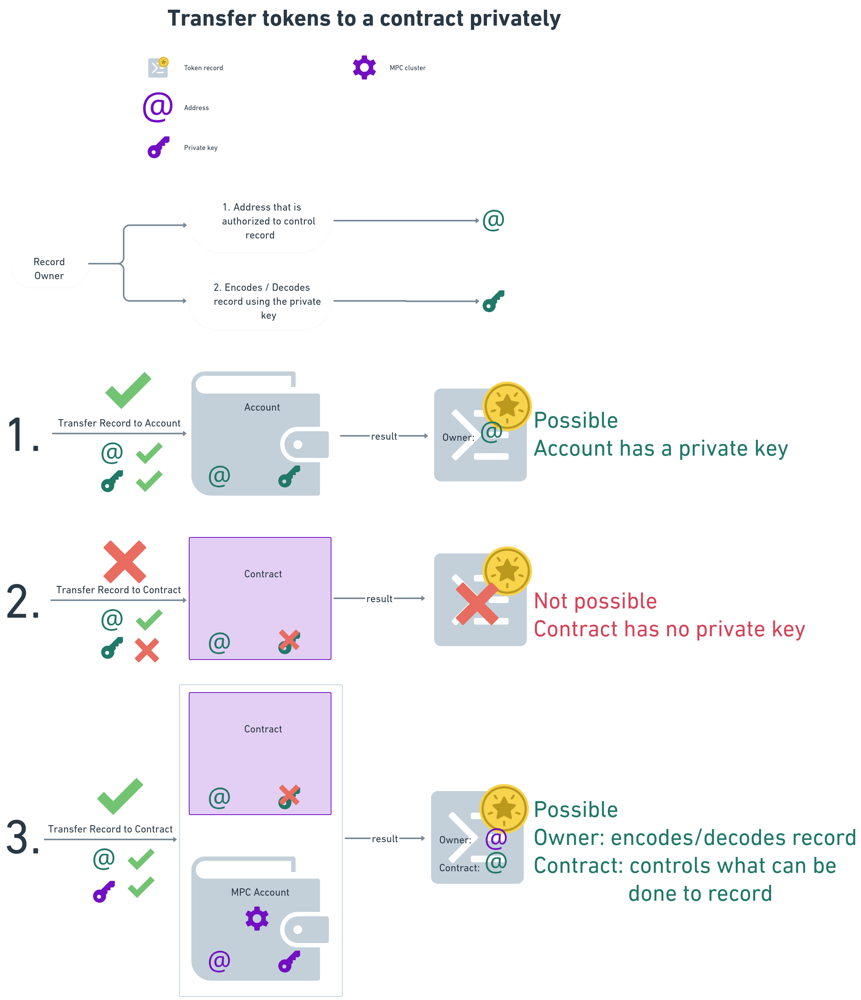
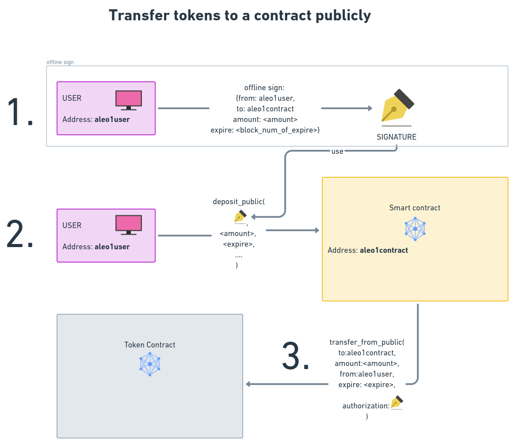

 
# Table of Contents
## [1. Abstract](#1_abstract)  
## [2. Specification](#2_specification)  
### [2.1. Terminology](#2_1_terminology)  
[2.1.1. Offline signature](#2_1_1_offline_signature)  
[2.1.2. MUST BE IMPLEMENTED](#2_1_2_must_be_implemented)  
[2.1.3. MUST NOT BE IMPLEMENTED](#2_1_3_must_not_be_implemented)  
[2.1.4. SHOULD BE IMPLEMENTED](#2_1_4_should_be_implemented)  
[2.1.5. NOT NEEDED](#2_1_5_not_needed)  
[2.1.6. NOT IMPLEMENTABLE](#2_1_6_not_implementable)  
[2.1.7. MUST BE](#2_1_7_must_be)  
[2.1.8. MUST HAVE](#2_1_8_must_have)  
[2.1.9. MUST](#2_1_9_must)  
[2.1.10. NEW FEATURE SHOULD BE IMPLEMENTED](#2_1_10_new_aleo_feature_should_be_implemented)  
[2.1.11. NEW FEATURE MUST BE IMPLEMENTED](#2_1_11_new_aleo_feature_must_be_implemented)  
[2.1.12. ZERO_ADDRESS](#2_1_12_zero_address)  
[2.1.13. MPC (Multi Party Computation)](#2_1_13_mpc_multi_party_computation)      
[2.1.14. `self.signer`](#2_1_14_self_signer)  
[2.1.15. `self.caller`](#2_1_15_self_caller)  
[2.1.16. Hacker](#2_1_16_hacker)  
### [2.2. Specification ](#2_2_specification_)  
[2.2.1. Name of token - MUST BE IMPLEMENTED](#2_2_1_name_of_token_must_be_implemented)  
[2.2.2. Symbol of token - MUST BE IMPLEMENTED](#2_2_2_symbol_of_token_must_be_implemented)  
[2.2.3. Company signature - MUST BE IMPLEMENTED](#2_2_3_company_signature_must_be_implemented)  
[2.2.3.1 Rationale for company signature](#2_2_3_1_rationale_for_company_signature)  
[2.2.3.2 Company signature constant - MUST BE IMPLEMENTED](#2_2_3_2_company_signature_constant_must_be_implemented)  
[2.2.3.3 CAU - Company Accounts URL - MUST BE IMPLEMENTED](#2_2_3_3_cau_company_accounts_url_must_be_implemented)  
[2.2.3.4 Invalidate signature - SHOULD BE IMPLEMENTED](#2_2_3_4_invalidate_signature_should_be_implemented)  
[2.2.3.5 Change CAU URL - SHOULD BE IMPLEMENTED](#2_2_3_5_change_cau_url_should_be_implemented)  
[2.2.3.6 Compromised private key of signing `account` - SHOULD BE IMPLEMENTED](#2_2_3_6_compromised_private_key_of_signing_account_should_be_implemented)  
[2.2.4. Approve of tokens - NOT NEEDED](#2_2_4_approve_of_tokens_not_needed)  
[2.2.5. Allowance of tokens - NOT NEEDED](#2_2_5_allowance_of_tokens_not_needed)  
[2.2.6. Decimals - MUST BE IMPLEMENTED](#2_2_6_decimals_must_be_implemented)  
[2.2.6.1. Decimals constant - MUST BE IMPLEMENTED](#2_2_6_1_decimals_constant_must_be_implemented)  
[2.2.6.2. Decimals transition - NOT NEEDED](#2_2_6_2_decimals_transition_not_needed)  
[2.2.6.2.1. Rationale for not having decimals as a transition](#2_2_6_2_1_rationale_for_not_having_decimals_as_a_transition)  
[2.2.7. Public balance of account - MUST BE IMPLEMENTED](#2_2_7_public_balance_of_account_must_be_implemented)  
[2.2.8 Private token record - MUST BE IMPLEMENTED](#2_2_8_private_token_record_must_be_implemented)  
[2.2.8.1 Rationale of private records being sent to contracts](#2_2_8_1_rationale_of_private_records_being_sent_to_contracts)  
[2.2.8.2 Design of `credits` record - MUST BE IMPLEMENTED](#2_2_8_2_design_of_credits_record_must_be_implemented)  
[2.2.9. Token transfer transitions - MUST BE IMPLEMENTED](#2_2_9_token_transfer_transitions_must_be_implemented)  
[2.2.9.1. Transfer public to private - MUST BE IMPLEMENTED](#2_2_9_1_transfer_public_to_private_must_be_implemented)  
[2.2.9.2. Transfer private to public - MUST BE IMPLEMENTED](#2_2_9_2_transfer_private_to_public_must_be_implemented)  
[2.2.9.3. Transfer tokens to account publicly - MUST BE IMPLEMENTED](#2_2_9_3_transfer_tokens_to_account_publicly_must_be_implemented)  
[2.2.9.4. Transfer tokens to contract publicly - MUST BE IMPLEMENTED](#2_2_9_4_transfer_tokens_to_contract_publicly_must_be_implemented)  
[2.2.9.5. Transition creating the hash to be signed - SHOULD BE IMPLEMENTED](#2_2_9_5_transition_creating_the_hash_to_be_signed_should_be_implemented)  
[2.2.9.6. Transfer tokens to accounts privately - MUST BE IMPLEMENTED](#2_2_9_6_transfer_tokens_to_accounts_privately_must_be_implemented)  
[2.2.9.7. Transfer tokens to contracts privately - MUST BE IMPLMENTED](#2_2_9_7_transfer_tokens_to_contracts_privately_must_be_implmented)  
[2.2.9.8. Transfer tokens of another account privately - NOT IMPLEMENTABLE](#2_2_9_8_transfer_tokens_of_another_account_privately_not_implementable)  
[2.2.10. Total Supply transition - NOT IMPLEMENTABLE](#2_2_10_total_supply_transition_not_implementable)  
[2.2.11. Total Supply mapping - SHOULD BE IMPLEMENTED](#2_2_11_total_supply_mapping_should_be_implemented)  
[2.2.11.1 Rationale of not having Total Supply mapping in a mandatory way](#2_2_11_1_rationale_of_not_having_total_supply_mapping_in_a_mandatory_way)  
[2.2.12. Join two records into one - MUST BE IMPLEMENTED](#2_2_12_join_two_records_into_one_must_be_implemented)  
[2.2.13. Split one record into two - MUST BE IMPLEMENTED](#2_2_13_split_one_record_into_two_must_be_implemented)  
[2.2.14 Mint tokens - SHOULD BE IMPLEMENTED](#2_2_14_mint_tokens_should_be_implemented)  
[2.2.15 Burn tokens - SHOULD BE IMPLEMENTED](#2_2_15_burn_tokens_should_be_implemented)  
### [2.3 Procedures ](#2_3_procedures_)  
[2.3.1. Deposit private token record to contract](#2_3_1_deposit_private_token_record_to_contract)  
[2.3.2. Deposit using `transfer_from_public()` transition](#2_3_2_deposit_using_transfer_from_public_transition)  
### [2.4. Test Cases](#2_4_test_cases)  
### [2.5. Reference Implementations](#2_5_reference_implementations)  
## [3. Dependencies](#3_dependencies)  
### [3.1. Backwards Compatibility](#3_1_backwards_compatibility)  
## [4. Security & Compliance](#4_security_compliance)  
## [5. References](#5_references)  

<a name="1_abstract"></a>
## 1. Abstract

There are several ARC-20 implementation standard proposals for the Aleo blockchain. This ARC provides a complete token standard for both public and private account/contract operations, and implement the followings:
1. Replaced onchain `approve()` functionality with [offchain signature](#tp) - `approve()` transition should not be implemented, instead user can agree to send token to a contract offchain using an offchain signature process to approve a transaction, and an onchain function eg [`transfer_from_public()`](#tp) that can apply that signature. This way smart contract interaction does not have to be a two step, but rather a one step process. This solution will save system resources as the approve part is offchain rather than onchain.
2. Enable [private token records to be sent to smart contracts](#deposit_private) - This problem must be addressed because one of the key selling points of Aleo is its programmable privacy. The author of this ARC also believes that to utilize the UTXO nature of Token records also leads to a much larger scalability than that can be achieved applying mappings and public tokens.
3. A signature scheme that [connects the contract with the main website](#company_signature) of the project. Thus make it easier for users to trust the token contract, and decrease the possibility of phishing attacks.

By applying the proposals pointed out in this ARC the token standard will be more usable because of:
1. one step approval process applying off chain signature, instead of two steps of `approve()` and `transfer_from()`, and 
2. the ability to send private tokens to smart contracts will enable a thriving DeFi life on top of the Aleo network.
3. make token contracts more secure by connecting them to the company website with a digital signature.


<!-- If someone only reads this far, what do you want them to know? -->


<a name="2_specification"></a>
## 2. Specification

<a name="2_1_terminology"></a>
### 2.1. Terminology

<a name="2_1_1_offline_signature"></a>
#### 2.1.1. Offline signature

In recent days Aleo has introduced signature verification in the snarkVM. This means that a user can sign a message offline, and then the signature can be verified onchain. This is a very important feature as it enables the user to sign a message offline, and then send the signature to the blockchain.  The signature verification is done by the snarkVM, and the signature is verified by the `signature::verify(s: signature, from: address, field_hash: field)` function. This way user can pre sign the transaction of allowing a certain amount of tokens to be transferred from his/her account to aan address.

<a name="2_1_2_must_be_implemented"></a>
#### 2.1.2. MUST BE IMPLEMENTED

If a feature is termed "MUST BE IMPLEMENTED" then it means that the feature is mandatory to be implemented to comply to this ARC. 

<a name="2_1_3_must_not_be_implemented"></a>
#### 2.1.3. MUST NOT BE IMPLEMENTED

If a feature is termed "MUST NOT BE IMPLEMENTED" then it means that the feature must NOT be implemented to comply to this ARC. Implementing this feature will lead to non-compliance to this ARC.

An implementation of the feature can lead to immediate token loss for users.

<a name="2_1_4_should_be_implemented"></a>
#### 2.1.4. SHOULD BE IMPLEMENTED

If a feature is termed "SHOULD BE IMPLEMENTED" then it means that the feature is not mandatory to be implemented to comply to this ARC, but it is highly recommended to be implemented. 

If the feature is indeed implemented, then it MUST BE implemented in a way described in this ARC. 

<a name="2_1_5_not_needed"></a>
#### 2.1.5. NOT NEEDED

If a feature is termed "NOT NEEDED" then it means that current ARC defines an alternative way of achieving the same functionality. 

<a name="2_1_6_not_implementable"></a>
#### 2.1.6. NOT IMPLEMENTABLE

If a feature is termed "NOT IMPLEMENTABLE" then it means that current implementation of snarkVM does not make it possible to implement the certain feature. 

<a name="2_1_7_must_be"></a>
#### 2.1.7. MUST BE

If a feature is termed "MUST BE" then it means that the feature is mandatory to be implemented accordingly to comply to this ARC. 

<a name="2_1_8_must_have"></a>
#### 2.1.8. MUST HAVE

If a feature is termed "MUST HAVE" then it means that the feature must contain something exactly the way it was defined after "MUST HAVE" was used to comply to this ARC. 

<a name="2_1_9_must"></a>
#### 2.1.9. MUST

Whatever follows MUST that must be implemented exactly as it was defined after "MUST" to comply with this ARC.

<a name="2_1_10_new_aleo_feature_should_be_implemented"></a>
#### 2.1.10. NEW FEATURE SHOULD BE IMPLEMENTED

Aleo should implement a feature that this ARC is based upon. Implementation of the feature not crucial for the operation of this ARC, but it is highly recommended to implement it. 

If it is implemented, then it MUST BE implemented in the way described in this ARC. (Or this ARC must be updated.)

<a name="2_1_11_new_aleo_feature_must_be_implemented"></a>
#### 2.1.11. NEW FEATURE MUST BE IMPLEMENTED

Aleo must implement the feature required by this ARC. If the feature is not implemented, then this ARC can not be implemented. 

<a name="zero_address"></a>
<a name="2_1_12_zero_address"></a>
#### 2.1.12. ZERO_ADDRESS

```leo
const ZERO_ADDRESS: address = aleo1yr9ls3d7cn2x2sr359kqq7vjkwnzr4x0e24ju6ysj2pte4c99c8qx0rwwl;
assert_eq(ZERO_ADDRESS, BHP256::hash_to_address(0group));
```

Because Aleo as at the time of the writing of this ARC does not have the Rust functionality of [Option](https://doc.rust-lang.org/std/option/) `None`, we must introduce an address that will be treated as `ZERO_ADDRESS` is the address that is created by applying `BHP256::hash_to_address(0group)`. The function of this address is that system takes it as if no address was provided at all.

Because of hashing applied the way above, the chance of an account will have the same address as `ZERO_ADDRESS` is negligible. 


<a name="mpc"></a>
<a name="2_1_13_mpc_multi_party_computation"></a>
#### 2.1.13. MPC (Multi Party Computation)

[Multi Party Computation](https://coinmarketcap.com/academy/article/what-are-multi-party-computation-mpc-wallets) is a decentralized solution of storing a private key of an account in a federated way thus making it impossible for any party (even the ones that are part of the MPC) to have access to the private key.  It can be used to create wallets that can be used to store private keys for contracts. The MPC MUST HAVE the following features:
1. The private key MUST be used to sign transactions, but  MUST NOT be possible to reconstruct the private key for any parties in the MPC or outside the MPC.
2. MPC MUST BE scalable. (As the number of parties constituting the MPC is not limited, and also multiple MPC clusters can be used to store the same private key and sign transactions parallelly, this is perfectly possible). 
3. MPC implementation MUST HAVE no way to handle users' funds any other way other than that set out by the smart contracts.
4. MPC MUST store all the secret data in encrypted form. This way even if the parts of the MPC cluster is compromised, the data will be useless for the attacker.
5. Compliance SHOULD BE implemented in the MPC system. This way authorities can request the MPC cluster to reveal a subset of data predefined by smart contracts.

<a name="si"></a>
<a name="2_1_14_self_signer"></a>
#### 2.1.14. `self.signer`

The account address whose private key is used to sign the transaction and decode encrypted records, is called `self.signer`. `self.signer` is always an account address. (As long as federated signature scheme is not introduced in Aleo).


See [Aleo documentation](https://developer.aleo.org/leo/language#selfcaller) for details.

<a name="sc"></a>
<a name="2_1_15_self_caller"></a>
#### 2.1.15. `self.caller`

The address of an account or a contract that called the transition is called `self.caller`. See figure above for details. 

See [Aleo documentation](https://developer.aleo.org/leo/language#selfcaller) for details.

<a name="2_1_16_hacker"></a>
#### 2.1.16. Hacker

Hacker is an entity that tries to alter the behavior of the system in a way that is not intended by the system, and thus win an illegitimate profit. 


<a name="2_2_specification_"></a>
### 2.2. Specification 

In this session the transitions, constants, and mappings are defined. Wherever name is specified for a transition, constant, or mapping, it is mandatory to use the specific name and the specific type(s) specified in this ARC. 

<a name="2_2_1_name_of_token_must_be_implemented"></a>
#### 2.2.1. Name of token - MUST BE IMPLEMENTED

`const NAME : field`: the name of the token. Eg: "Aleo Credits"  

A unicode string of byte length of 16. The left most character of string should be the highest byte of the `field` number. As an example "Aleo Credits" must be encoded as follows: `0x416C656F20637265646974730000000000000000000000000000000000000000  = 29591854713254390051098558719843710286620636002170764447558050801690808942592field`. 

Once `string` type is included in Aleo specification, this ARC must be updated.

<a name="2_2_2_symbol_of_token_must_be_implemented"></a>
#### 2.2.2. Symbol of token - MUST BE IMPLEMENTED


`const SYMBOL : field`: the symbol of the token. Eg: "ALEO"  

A unicode string of byte length of 16. The left most character of string should be the highest byte of the `field` number. As an example "ALEO" should be encoded as follows: `0x414C454F00000000000000000000000000000000000000000000000000000000 = 29535093885169187707116277799267314899879263164026335641338301482164084015104field`. 

Once `string` type is included in Aleo specification, this ARC must be updated.

<a name="company_signature"></a>
<a name="2_2_3_company_signature_must_be_implemented"></a>
#### 2.2.3. Company signature - MUST BE IMPLEMENTED

<a name="2_2_3_1_rationale_for_company_signature"></a>
##### 2.2.3.1 Rationale for company signature

Companies that create smart contracts must be able to have a standardized mechanism to connect their contracts to their website. This is a means to minimize fake contracts stealing users funds. This can be done by createing a standardized URL: CAU - Company Addresses URL, that MUST return the JSON array of signer addresses, their validity, and corresponding CAU signatures of the company. On the smart contract side all contracts MUST HAVE a constant called `COMPANY_SIGNATURE` that MUST BE the signature of the contract name created by the private key of the signer address. This way users can check if the contract is belonging to the Company.

Blockhain explorers can utilize this feature to display the website that the contract belongs to. Explorers can request the [CAU](#cau) URL from developer, when the contract is verified, and then display the website of the company to the users. This way users can be sure that the contract is indeed belonging to the certain company.

Wallets can use the same mechanism to check legitimacy of a specific contract the same way explorers can. 

<a name="csc"></a>
<a name="2_2_3_2_company_signature_constant_must_be_implemented"></a>
##### 2.2.3.2 Company signature constant - MUST BE IMPLEMENTED

```leo
const COMPANY_SIGNATURE: signature = <signature_literal>;
```

`signature` must be created by Aleo signing scheme the following way:

`signature = aleo::sign_message(<program_name>, pk)`: where 
1. `aleo::sign_message` is the [message signing scheme](https://developer.aleo.org/aleo/language/#signatures) of Aleo.
2. `<program_name>` is the name of the ARC20 token. Eg: "ARC20_0001.aleo". The extension of the program name MUST BE ".aleo".
3. `pk` is the private key of the `account_address` of company. 


<a name="cau"></a>
<a name="2_2_3_3_cau_company_accounts_url_must_be_implemented"></a>
##### 2.2.3.3 CAU - Company Accounts URL - MUST BE IMPLEMENTED

CAU - Company Accounts URL: `https://<company-domain.com>/aleo_signer_accounts/` 

where `<company-domain.com>` is the domain name of the company. 

This URL called upon by the GET method must return a JSON array of objects each containing 
1. `account`: Aleo address whose private keys are used by company to sign its contracts, and 
2. `status`: String that MUST BE one of `active`, `exprired`, and `compromised`.
    1. If account is `active` it means that it is actively propagated by the Company owning CAU and the account is not compromised.
    2. If account is `expired` it means that Company has disowned the contract, and users should treat contract as if it is not belonging to the Company.
    3. If account is `compromised` it means that the private key has been compromised, and Company has disowned the contract, and users should treat contract as if it is not belonging to the Company. 
2. `cau_signature` a signature that connects the CAU to the `account`.

Example return: 

```json
[
    {
        "account": "aleo1qz34g0zdl0ztlval9vxer75uf2t9q7jgf4g8cuxv5q5c8lz6x5rssucpm5", 
        "status": "active",
        "cau_signature": "sign01111111111111111111111111111111111111111111111111111111111111111111111111111111111111111111111111111111111111111111111111111111111111111111111111111111111111111111111111111111111111111111111111111111111111111111"
    }, 
    {
        "account": "aleo1yx5aq4tsgvraxu63vtjq5tqefkwcv4pk7yxyc5hswl7jdlktggyqf4a52f"
        "status": "active",
        "cau_signature": "sign02222222222222222222222222222222222222222222222222222222222222222222222222222222222222222222222222222222222222222222222222222222222222222222222222222222222222222222222222222222222222222222222222222222222222222222"
    },
    {
        "account": "aleo17wmuq5n08vs0tt356uhc6hlljy8c95zteqpa2ne8kcw3sa0rt5yqg7jdys",
        "status": "expired",
        "cau_signature": "sign03333333333333333333333333333333333333333333333333333333333333333333333333333333333333333333333333333333333333333333333333333333333333333333333333333333333333333333333333333333333333333333333333333333333333333333"
    }
]
```
To ensure that a contract is indeed belonging to the company, both of the following conditions MUST BE satisfied:

1. Lets assume that from the returned list of accounts an account called `signing_account` does satisfy the following equality:

    `aleo::verify_message(program_name, COMPANY_SIGNATURE, signing_account) == true`: where 
    1. `program_name` is the name of the ARC20 token. Eg: "ARC20_0001.aleo". The extension of the program name MUST BE ".aleo".
    2. [`COMPANY_SIGNATURE`](#csc) is the signature of the `program_name` created by the private key of the `account` address.
    3. `signing_account` is the current address returned by Company Accounts URL. 

    If `signing_account` does indeed satisfy (1.) then there is a mathematical proof that this account indeed has signed the `program_name` program.

2. `cau_signature` belonging to `signing_account` MUST satisfy the `aleo::verify_message(concatenate(cau, status), cau_signature, signing_account) == ture` equation, where 
    1. `cau` is the [CAU - Company Accounts URL](#cau).
    2. `status` is the status of the `signing_account`. 
    2. `cau_signature` is the signature of the CAU created by the private key of the `signing_account` address.
    3. `signing_account` is the `account` that the same as in (1.) above.
`cau_signature` signature ensures that the JSON array of addresses indeed belong to the Company Accounts URL.
    
    If `signing_account` and `cau_signature` do indeed satisfy (2.) then there is a mathematical proof that this account indeed signed the `cau` URL, thus the CAU has legitimately listed the account as its own. This gives protection against sites falsely claiming that `accounts` are theirs.
    
If [`COMPANY_SIGNATURE`](#csc) and none of the returned `account`s and corresponding `cau_signatures` satisfy both (1.) and (2.) then the contract MUST BE considered as not belonging to the company.

IF BOTH (1.) and (2.) are satisfied by [`COMPANY_SIGNATURE`](#csc), `signing_account` and corresponding `cau_signature` then the contract MUST BE considered as belonging to the company.

<a name="2_2_3_4_invalidate_signature_should_be_implemented"></a>
##### 2.2.3.4 Invalidate signature - SHOULD BE IMPLEMENTED

To remove signature validity Companies MUST change the `status` field to `expired` of the associated `account` from the CAU JSON array. This way the signature will not be valid anymore. 

<a name="2_2_3_5_change_cau_url_should_be_implemented"></a>
##### 2.2.3.5 Change CAU URL - SHOULD BE IMPLEMENTED

In case of rebranding or other reasons Companies CAN change the CAU URL. The `cau_signature` MUST BE updated to sign the new CAU and associate those to `account` addresses in returned JSON array. 

They also should update the CAU with blockchain explorers.

<a name="2_2_3_6_compromised_private_key_of_signing_account_should_be_implemented"></a>
##### 2.2.3.6 Compromised private key of signing `account` - SHOULD BE IMPLEMENTED

In case private key of signing `account` is compromised, then the `status` field MUST BE set to `compromised` in the returned JSON array. This way the signature will not be valid anymore. Users of contract should treat the contract as if it is not belonging to the company.

If there is an other website of Hacker not belonging to Company that has stolen the private key of a signing account of Company, and creates a fake site stating that the contract is indeed belonging to the Hacker, then the Company can invalidate the signature by setting the `status` field to `compromised` in the returned JSON array. Explorers in case of contradicting CAU URLs should always use the one that was used previously to avoid the attack of Hacker.

<a name="2_2_4_approve_of_tokens_not_needed"></a>
#### 2.2.4. Approve of tokens - NOT NEEDED

~~`approve(to: address, amount: u64) -> ()`~~ transition is not needed in this design.

Instead of ~~`approve()`~~ transition the [`transfer_from_public()`](#tp) transition should be used. And a signature of that transaction should be created offline beforehand. This setup uses less system resources and thus more scalable then to use ~~`approve()`~~ that would use mappings . 

<a name="2_2_5_allowance_of_tokens_not_needed"></a>
#### 2.2.5. Allowance of tokens - NOT NEEDED

~~`allowance() -> u64`~~ function is not needed in this design. 

As in the [`transfer_from_public()`](#tp) transition the signature parameter contains the approval. See  [`transfer_from_public()`](#tp) function above.


As in the [`transfer_from_public()`](#tp) transition the signature parameter contains the approval. See  [`transfer_from_public()`](#tp) function above.

<a name="2_2_6_decimals_must_be_implemented"></a>
#### 2.2.6. Decimals - MUST BE IMPLEMENTED

<a name="decimals"></a>
<a name="2_2_6_1_decimals_constant_must_be_implemented"></a>
##### 2.2.6.1. Decimals constant - MUST BE IMPLEMENTED

`const DECIMALS : u8`: constant containing the deimal precision of the current token.

<a name="2_2_6_2_decimals_transition_not_needed"></a>
##### 2.2.6.2. Decimals transition - NOT NEEDED
~~`decimals() -> u8`~~: transition returning the decimal precision of the current token.

This transition is not needed as the [`DECIMALS`](#decimals) constant is already defined for the same purpose.

<a name="2_2_6_2_1_rationale_for_not_having_decimals_as_a_transition"></a>
###### 2.2.6.2.1. Rationale for not having decimals as a transition

As `DECIMALS` is a constant  (see [above](#decimals)), and MUST BE IMPLEMENTED, it is easy to query and provide it as input of any transition necessary. There is no need to implement an extra function for this.

<a name="2_2_7_public_balance_of_account_must_be_implemented"></a>
#### 2.2.7. Public balance of account - MUST BE IMPLEMENTED

`mapping account : address => u64`: the public balance of an account. The `address` is the address of the account. The `u64` is the amount of tokens the account has. 

<a name="2_2_8_private_token_record_must_be_implemented"></a>
#### 2.2.8 Private token record - MUST BE IMPLEMENTED

<a name="private_records_to_contracts"></a>
<a name="2_2_8_1_rationale_of_private_records_being_sent_to_contracts"></a>
##### 2.2.8.1 Rationale of private records being sent to contracts

There are two reasons why private token records should be sent to contracts:
1. To enable private (but compliant) DeFi on Aleo.
2. To enable the scalability of the token system.

Private DeFi is a must have feature for Aleo to be able to compete with other blockchains. 

Scalability can be achived better with records than with mappings. Because with mappings all the validators must rerun the transaction which has `O(n)` difficulty, where `n` is the number of instructions, while with private records it is `O(1)` because all validators have to do is check the validity of a proof. Thus applying records leads to a much more scalable system.  


The easiest implementation of sending private tokens to a smart contract would be to just simply set the `owner` field to that of the destination contract (2.). With currernt setup this is not possible as currently contracts do not have a private keys, that would allow them to encode/decode private record data. So in the optimal solution the contract as an `owner` would have two capabilities in one:
1. It would have an address that is authorized to control the record.
2. It would have a private key that can encode and decode the record data.

Currently (2.) is not possible as contracts do not have a federated private key. So the ownership and the encoding/decoding of private data must be separated:
1. The `owner` field of the record will be the address of the [MPC](#mpc) cluster that has the federated private key to encode and decode the private data.
2. The new `contract` field of the record will be the address of the contract that the record is sent to.

The current ARC implementation MUST make sure that [MPC](#mpc) can only operate on record by calling the methods of `contract`. [MPC](#mpc) MUST NOT be able to call transitions of record contract directly. 

This will reflect in the design of the `credits` record. 

<a name="2_2_8_2_design_of_credits_record_must_be_implemented"></a>
##### 2.2.8.2 Design of `credits` record - MUST BE IMPLEMENTED

The `credits` record MUST HAVE three fields instead of just two: 
1. `owner` - private `address`, the owner of the record. This is the account that has the right to encode and decode the private data. If a record is owned by a contract, than this field MUST BE the account address of the MPC cluster that has the federated private key to encode and decode the private data.
2. `contract` - private `address`, the contract that the record is sent to. If the record is sent to an account, then this field MUST BE [`ZERO_ADDRESS`](#zero_address). If the record is sent to a contract, then this field MUST BE the address of the contract. 
3. `microcredits` - private `u64`, the amount of tokens the record contains. This field MUST BE public.

The record MUST HAVE the following definition:
```
record credits {
    owner: address,
    contract: address,
    microcredits: u64
}
```

If the `contract` field is not [`ZERO_ADDRESS`](#zero_address) then the this token contract MUST only accept calls whose [`self.signer`](#si) is the the `credit.owner` and the [`self.caller`](#sc) is the `credit.contract`. This way only `contract` can control the private record, but the MPC as the `owner` can encode and decode the private data. 

<a name="2_2_9_token_transfer_transitions_must_be_implemented"></a>
#### 2.2.9. Token transfer transitions - MUST BE IMPLEMENTED

Token transfer transitions are the transitions that can be used to transfer tokens from one account to another. The following transitions are defined in this ARC:
1. transfer from public to private and vice versa,
    1. [`transfer_public_to_private(..)`](#transfer_public_to_private)
    2. [`transfer_private_to_public(..)`](#transfer_private_to_public)
2. that transfers to another account or contract publicly,
    1. [`transfer_public(..)`](#tpa) - transfer to another account
    2. [`transfer_from_public(..)`](#tp) - transfer to a contract
    3. [`hash_to_sign(..)`](#hts) - helper function to `transfer_from_public()` to create the hash to be signed
3. that transfers to an account or contract privately.
    1. [`transfer_private(..)`](#transfer_private) - transfer to an account
    2. [`transfer_private_contract(..)`](#transfer_private_contract) - transfer to a contract


<a name="transfer_public_to_private"></a>
<a name="2_2_9_1_transfer_public_to_private_must_be_implemented"></a>
##### 2.2.9.1. Transfer public to private - MUST BE IMPLEMENTED

`transfer_public_to_private(to: address, public amount: u64) -> credits`: transfer to `address` from [`self.signer`](#si) an `amount` of tokens. Returns the record of `credits` that is private.  

``` aleo
function transfer_public_to_private:
    input r0 as address.private;
    input r1 as u64.public;
    is.neq self.caller self.signer into r2;
    ternary r2 self.caller aleo1yr9ls3d7cn2x2sr359kqq7vjkwnzr4x0e24ju6ysj2pte4c99c8qx0rwwl into r3;
    cast r0 r3 r1 into r4 as credits.record;
    async transfer_public_to_private self.caller r0 r1 into r5;
    output r4 as credits.record;
    output r5 as arc20_0001.aleo/transfer_public_to_private.future;

finalize transfer_public_to_private:
    input r0 as address.public;
    input r1 as address.public;
    input r2 as u64.public;
    get account[r0] into r3;
    sub r3 r2 into r4;
    set r4 into account[r0];
```

In case the `amount` is greater than the public balance of [`self.signer`](#si) then the transition MUST fail.

<a name="transfer_private_to_public"></a>
<a name="2_2_9_2_transfer_private_to_public_must_be_implemented"></a>
##### 2.2.9.2. Transfer private to public - MUST BE IMPLEMENTED

`transfer_private_to_public(credit: credits, public to: address, public amount: u64) -> credits`: transfer from private record of `credits` to `to` address in a way that his public balance will increase with `amount` and the private balance of `credit` will decrease with `amount`. MUST return the remainder record of `credits` that is private.

```aleo
function transfer_private_to_public:
    input r0 as credits.record;
    input r1 as address.public;
    input r2 as u64.public;
    is.eq self.caller self.signer into r3;
    is.eq r0.contract aleo1yr9ls3d7cn2x2sr359kqq7vjkwnzr4x0e24ju6ysj2pte4c99c8qx0rwwl into r4;
    not r3 into r5;
    or r5 r4 into r6;
    assert.eq r6 true;
    is.eq self.caller r0.contract into r7;
    is.eq self.signer r0.owner into r8;
    is.eq r0.contract aleo1yr9ls3d7cn2x2sr359kqq7vjkwnzr4x0e24ju6ysj2pte4c99c8qx0rwwl into r9;
    and r8 r9 into r10;
    or r7 r10 into r11;
    not r3 into r12;
    not r12 into r13;
    or r13 r11 into r14;
    assert.eq r14 true;
    sub r0.microcredits r2 into r15;
    cast r0.owner r0.contract r15 into r16 as credits.record;
    async transfer_private_to_public r1 r2 into r17;
    output r16 as credits.record;
    output r17 as arc20_0001.aleo/transfer_private_to_public.future;

finalize transfer_private_to_public:
    input r0 as address.public;
    input r1 as u64.public;
    get.or_use account[r0] 0u64 into r2;
    add r2 r1 into r3;
    set r3 into account[r0];
```

In case the `amount` is greater than the private balance of `credit` then the transition MUST fail.

<a name="tpa"></a>
<a name="2_2_9_3_transfer_tokens_to_account_publicly_must_be_implemented"></a>
##### 2.2.9.3. Transfer tokens to account publicly - MUST BE IMPLEMENTED

`transfer_public(public to: address, public amount: u64)`: send from [`self.signer`](#si) (the transition's signer's)  address to `to` address an amount of `amount` of tokens publicly. To address MUST BE an account address.

```aleo
function transfer_public:
    input r0 as address.public;
    input r1 as u64.public;
    async transfer_public self.caller r0 r1 into r2;
    output r2 as arc20_0001.aleo/transfer_public.future;

finalize transfer_public:
    input r0 as address.public;
    input r1 as address.public;
    input r2 as u64.public;
    get account[r0] into r3;
    sub r3 r2 into r4;
    set r4 into account[r0];
    get.or_use account[r1] 0u64 into r5;
    add r5 r2 into r6;
    set r6 into account[r1];
```
If the `amount` is greater than the public balance of [`self.signer`](#si) then the transition MUST fail.

<a name="tp"></a>
<a name="2_2_9_4_transfer_tokens_to_contract_publicly_must_be_implemented"></a>
##### 2.2.9.4. Transfer tokens to contract publicly - MUST BE IMPLEMENTED

`transfer_from_public(  
    public to: address,  
    public amount: u64,  
    public from: address,  
    public expire: u32  
    authorization: signature,  
) -> ()`: transfers from `from` address to `to` address an amount of `amount` tokens using the  `authorization` signature previously created by `from` address offline, if the `block.height` is less than `expire`. 

```aleo
function transfer_from_public:
    input r0 as address.public;
    input r1 as u64.public;
    input r2 as address.public;
    input r3 as u32.public;
    input r4 as signature.private;
    cast r2 r0 r1 r3 into r5 as transfer_from;
    hash.bhp256 r5 into r6 as field;
    sign.verify r4 r2 r6 into r7;
    assert.eq r7 true;
    async transfer_from_public r0 r1 r2 r3 into r8;
    output r8 as arc20_0001.aleo/transfer_from_public.future;

finalize transfer_from_public:
    input r0 as address.public;
    input r1 as u64.public;
    input r2 as address.public;
    input r3 as u32.public;
    lt block.height r3 into r4;
    assert.eq r4 true;
    get account[r2] into r5;
    sub r5 r1 into r6;
    set r6 into account[r2];
    get.or_use account[r0] 0u64 into r7;
    add r7 r1 into r8;
    set r8 into account[r0];
```

Please see [2.3.2 Deposit using `transfer_from_public()` transition](#deposit_public) for details.

The `authorization` is NOT public, this way it is impossible for third party to replay attack user's tokens. Note: `allowance()` furnction is not needed in this design, as the signature contains the approval. 

It MUST be possible to transfer tokens to contracts using this transition.

<a name="hts"></a>
<a name="2_2_9_5_transition_creating_the_hash_to_be_signed_should_be_implemented"></a>
##### 2.2.9.5. Transition creating the hash to be signed - SHOULD BE IMPLEMENTED

`hash_to_sign(  
    to: address,  
    amount: u64,  
    from: address,  
    expire: u32  
) -> field`: returns the hash of the data that needs to be signed by `from` address to create the `authorization` signature for [`transfer_from_public()`](#tp). 

```aleo
function hash_to_sign:
    input r0 as address.private;
    input r1 as u64.private;
    input r2 as address.private;
    input r3 as u32.private;
    cast r2 r0 r1 r3 into r4 as transfer_from;
    hash.bhp256 r4 into r5 as field;
    output r5 as field.private;
```

All the parameters MUST BE private.  

This transition MUST create the hash that can be used to create the `authorization` signature offchain. 

This transition is used to generate the `signature` parameter for [`transfer_from_public()`](#tp) transition.

This transition is only needed as long as there is no easy alternative offchain solution is found to create the hash.

Contracts MUST NOT rely on the availability of this transition, as it is not mandatory. 

<a name="transfer_private"></a>
<a name="2_2_9_6_transfer_tokens_to_accounts_privately_must_be_implemented"></a>
##### 2.2.9.6. Transfer tokens to accounts privately - MUST BE IMPLEMENTED

`transfer_private(to: address, amount: u64, credit: credits) -> (credits,credits)`: send from [`self.signer`](#si) (the transition's signer's)  address to `to` address an amount of `amount` of tokens of `credit` privately. 

```aleo
function transfer_private:
    input r0 as address.private;
    input r1 as u64.private;
    input r2 as credits.record;
    is.eq self.caller self.signer into r3;
    is.eq r2.contract aleo1yr9ls3d7cn2x2sr359kqq7vjkwnzr4x0e24ju6ysj2pte4c99c8qx0rwwl into r4;
    not r3 into r5;
    or r5 r4 into r6;
    assert.eq r6 true;
    is.eq self.caller r2.contract into r7;
    is.eq self.signer r2.owner into r8;
    is.eq r2.contract aleo1yr9ls3d7cn2x2sr359kqq7vjkwnzr4x0e24ju6ysj2pte4c99c8qx0rwwl into r9;
    and r8 r9 into r10;
    or r7 r10 into r11;
    not r3 into r12;
    not r12 into r13;
    or r13 r11 into r14;
    assert.eq r14 true;
    sub r2.microcredits r1 into r15;
    cast r2.owner r2.contract r15 into r16 as credits.record;
    cast r0 aleo1yr9ls3d7cn2x2sr359kqq7vjkwnzr4x0e24ju6ysj2pte4c99c8qx0rwwl r1 into r17 as credits.record;
    output r16 as credits.record;
    output r17 as credits.record;
```

This function can only be used to send tokens privately to an account. To transfer tokens privately to a contract, the [`transfer_private_contract()`](#transfer_private_contract) must be used by the receiving contract (for details see [pocedure 2.3.1](#deposit_private)). 

It MUST return a tuple of two records in the order below:
1. Remainder record - the remainder of `credit` that is left for sender after sending `amount` of it to `to` address. It MUST HAVE the following fields set. All of which MUST BE private: 
    1. `owner` private `address`, must be the same as that of the input record `credit`.
    2. `contract`  private `address`, must be the same as that of the input record `credit`.
    3. `microcredits` private `u64`, field MUST BE the remainder of `microcredits` after having spent `amount`;
2. Record sent, with the following fields. All of which MUST BE private:
    1. `owner` private `address`, must be set to `to` address.
    2. `contract` private `address`, if the contract was called 
        1. by an account (`self.caller == self.signer`), then `credit.contract` must be equal to [`ZERO_ADDRESS`](#zero_address) if not transition MUST fail, then [`ZERO_ADDRESS`](#zero_address).
        2. by a contract (`self.caller != self.signer`), then [`self.caller`](#sc)  must be equal to `credit.contract`, or the transaction initiator ([`self.signer`](#si)) must be equal to `credit.owner` and `credit.contract` MUST BE equal to  [`ZERO_ADDRESS`](#zero_address), if not transition MUST fail, then [`self.caller`](#sc).
    3. `microcredits` private `u64`, field MUST BE the amount of `amount` of tokens that was sent.

It MUST be able to transfer tokens to contracts using this transition.

<a name="transfer_private_contract"></a>
<a name="2_2_9_7_transfer_tokens_to_contracts_privately_must_be_implmented"></a>
##### 2.2.9.7. Transfer tokens to contracts privately - MUST BE IMPLMENTED

`transfer_private_contract(to: address, amount: u64, contract: address, credit: credits) -> (credits,credits)`: This function enables sending private token record to a Smart Contract with MPC, by directly setting the `to` and `contract` fields of the resulting record. This transition MUST only be called by a contract. If called by an account, then the transition MUST fail. 

```aleo
function transfer_private_contract:
    input r0 as address.private;
    input r1 as address.private;
    input r2 as u64.private;
    input r3 as credits.record;
    is.neq self.caller self.signer into r4;
    assert.eq r4 true;
    is.eq self.caller r3.contract into r5;
    is.eq self.signer r3.owner into r6;
    is.eq r3.contract aleo1yr9ls3d7cn2x2sr359kqq7vjkwnzr4x0e24ju6ysj2pte4c99c8qx0rwwl into r7;
    and r6 r7 into r8;
    or r5 r8 into r9;
    assert.eq r9 true;
    sub r3.microcredits r2 into r10;
    cast r3.owner r3.contract r10 into r11 as credits.record;
    cast r0 r1 r2 into r12 as credits.record;
    output r11 as credits.record;
    output r12 as credits.record;
```
Transfer from account must be denied as users CAN confuse the `to` address with `contract` address, and that leads to immediate token loss. While [pocedure 2.3.1](#deposit_private) can do this safely.

<a name="2_2_9_8_transfer_tokens_of_another_account_privately_not_implementable"></a>
##### 2.2.9.8. Transfer tokens of another account privately - NOT IMPLEMENTABLE

This functionality is not implementable with current setup. But the same functionality can be achieved by using [`transfer_public_to_private()`](#transfer_public_to_private) and [`transfer_private()`](#transfer_private). 

<a name="2_2_10_total_supply_transition_not_implementable"></a>
#### 2.2.10. Total Supply transition - NOT IMPLEMENTABLE

~~`total_supply()`~~: returns `u128` the total amount of tokens currently in circulation.

<a name="2_2_11_total_supply_mapping_should_be_implemented"></a>
#### 2.2.11. Total Supply mapping - SHOULD BE IMPLEMENTED

```
mapping total_supply : bool => u64;
```

`Mapping::get(total_supply, true)` MUST return  `u64` the total amount of tokens currently in circulation.

If a token is minted, then this mapping must be updated. If a token is burned, then this mapping must also be updated. 

Contracts MUST NOT rely on the availability of this mapping, as it is not mandatory. 

<a name="2_2_11_1_rationale_of_not_having_total_supply_mapping_in_a_mandatory_way"></a>
##### 2.2.11.1 Rationale of not having Total Supply mapping in a mandatory way

Maintaining the `total_supply` in a mapping means that for each `mint()` and `burn()` function this mapping must be updated. And as it is a mapping, it means that all validators must re-run the transaction, which is `O(n)` difficulty, where `n` is the number of instructions in the finalize function. This is much less scalable as if the `total_supply`  is maintained as a record, and each validator only has to check the validity of the proof, which is `O(1)` difficulty. Thus making the contract more scalable.

<a name="2_2_12_join_two_records_into_one_must_be_implemented"></a>
#### 2.2.12. Join two records into one - MUST BE IMPLEMENTED

`join(credit1: credits, credit2: credits) -> credits`: joins `credit1` and `credit2` records into one.

```aleo
function join:
    input r0 as credits.record;
    input r1 as credits.record;
    is.neq self.caller self.signer into r2;
    is.eq r0.contract self.caller into r3;
    is.eq r1.contract self.caller into r4;
    and r3 r4 into r5;
    not r2 into r6;
    or r6 r5 into r7;
    assert.eq r7 true;
    add r0.microcredits r1.microcredits into r8;
    cast r0.owner r0.contract r8 into r9 as credits.record;
    output r9 as credits.record;
```
<a name="2_2_13_split_one_record_into_two_must_be_implemented"></a>
#### 2.2.13. Split one record into two - MUST BE IMPLEMENTED

`split(credit: credits, amount: u64) -> (credits,credits)`: splits `credit` record into two records. The first record is the remainder of `credit` after having spent `amount` of it. The second record is the `amount` of `credit` that was spent.

```aleo
function split:
    input r0 as credits.record;
    input r1 as u64.private;
    is.neq self.caller self.signer into r2;
    is.eq r0.contract self.caller into r3;
    not r2 into r4;
    or r4 r3 into r5;
    assert.eq r5 true;
    sub r0.microcredits r1 into r6;
    cast r0.owner r0.contract r6 into r7 as credits.record;
    cast r0.owner r0.contract r1 into r8 as credits.record;
    output r7 as credits.record;
    output r8 as credits.record;
```
<a name="2_2_14_mint_tokens_should_be_implemented"></a>
#### 2.2.14 Mint tokens - SHOULD BE IMPLEMENTED

`mint(amount: u64) -> ()`: mints `amount` of tokens to the caller of the transition. 

```aleo
function mint:
    input r0 as u64.private;
    async mint self.caller r0 into r1;
    output r1 as arc20_0001.aleo/mint.future;

finalize mint:
    input r0 as address.public;
    input r1 as u64.public;
    get.or_use account[r0] 0u64 into r2;
    add r2 r1 into r3;
    set r3 into account[r0];
    get.or_use total_supply[true] 0u64 into r4;
    add r4 r1 into r5;
    set r5 into total_supply[true];
```
MUST update `total_supply`.

<a name="2_2_15_burn_tokens_should_be_implemented"></a>
#### 2.2.15 Burn tokens - SHOULD BE IMPLEMENTED

`burn(amount: u64) -> ()`: burns `amount` of tokens of the caller of the transition. 

```aleo
function burn:
    input r0 as u64.private;
    async burn self.caller r0 into r1;
    output r1 as arc20_0001.aleo/burn.future;

finalize burn:
    input r0 as address.public;
    input r1 as u64.public;
    get account[r0] into r2;
    sub r2 r1 into r3;
    set r3 into account[r0];
    get.or_use total_supply[true] 0u64 into r4;
    sub r4 r1 into r5;
    set r5 into total_supply[true];
```

MUST update `total_supply`.

<a name="2_3_procedures_"></a>
### 2.3 Procedures 

<a name="deposit_private"></a>
<a name="2_3_1_deposit_private_token_record_to_contract"></a>
#### 2.3.1. Deposit private token record to contract


User has an address of `aleo1user`, Smart Contract has a contract address of `aleo1contract`, and MPC has an account address of `aleo1mpc`. User has a record with the following fields:

```
credit {
    owner: aleo1user,
    contract: ZERO_ADDRESS,
    microcredits: 10M
}
```

Deposit privately works as follows:
1. User calls the Smart Contract's `deposit_private(credit, ...)` transition. (The name (`deposit_private()`) of the transition can be defined by contract developers.)
2. During the execution of `deposit_private()`, the Smart Contract calls the `transfer_private(to: aleo1mpc, amount: 10M, credit: credits)` function on ARC20 contract using the record provided by user in previous step.
3. ARC20 contract consumes the received `credit` record, and creates a new one with the followings:

```
credit {
    owner: aleo1mpc,
    contract: aleo1contract,
    microcredits: 10M
}
```

This record can not be sent by MPC to any other contract than `aleo1contract`, because that MUST BE denied by ARC20 contract. MPC can only send the record to `aleo1contract` and the predefined transitions of `aleo1contract` will limit what can be done with the credit record.


<a name="deposit_public"></a>
<a name="2_3_2_deposit_using_transfer_from_public_transition"></a>
#### 2.3.2. Deposit using `transfer_from_public()` transition



User can send tokens to a contract publicly the following way:
1. User authorizes the sending of tokens to contract by signing the details of the `transfer_from_public` transaction offline. His steps are as follows:
    1. Create `auth_hash = BHP256::hash_to_field(from, to, amount, expire)` offline, where 
        1. `from` is the user's account address,
        2. `to` is the contracts address,
        3. `amount` is the aonut of tokens he agrees to send to contract,
        4. `expire` is the blocknumber when this authorization exprires.
    2. Signs the hash offline `authorization = aleo.sign(auth_hash, pk)`, Where:
        1. `auth_hash` is the hash created in previous step.
        2. `pk` is the private key of his account address.
2. User calls the `deposit_public(authorization, to, amount, expire, ...)` function of contract. The name is not defined in this ARC, CAN BE any name the contract's creator wants. Within this transition contract
    1. Checks if `to` is an address where he accepts tokens.
    2. Calls the `transfer_from_public(authorization, to, amount, self.caller, expire)` function on the token contract, and this way transfers the tokens to himself.

<a name="2_4_test_cases"></a>
### 2.4. Test Cases

This section should introduce any and all critical test cases that need to be considered for the specification.

<!-- Provide any test vectors that should be included in unit and/or integration tests. -->

<!-- Are there edge cases to be aware of? -->

<!-- Include test code snippets, if possible. -->


<a name="2_5_reference_implementations"></a>
### 2.5. Reference Implementations

Please refer to the reference implementation:
1. Aleo language [reference implementation](https://github.com/r001/arc20_0001/blob/main/reference/main.aleo).
2. Leo language [reference implementation](https://github.com/r001/arc20_0001/blob/main/src/main.leo).

<!-- Link to any related Github branches and/or pull requests. -->


<a name="3_dependencies"></a>
## 3. Dependencies

The following components are affected by this standard:
1. `credits.aleo` - MUST BE UPGRADED TO COMPLY TO THIS ARC  
    The program MUST BE updated as defined in this ARC. Upgrading will introduce full contract support for `credits.aleo`  program.
2. leo - BUGFIX NEEDED  
    Current bug in compiler MUST BE FIXED.  
    Compiler currently does not recognize signature literal in the following example:
    ```leo
    const COMPANY_SIGNATURE: signature = sign069ju4e8s66unu25celqycvsv3k9chdyz4n4sy62tx6wxj0u25vqp58hgu9hwyqc63qzxvjwesf2wz0krcvvw9kd9x0rsk4lwqn2acqhp9v0pdkhx6gvkanuuwratqmxa3du7l43c05253hhed9eg6ppzzfnjt06fpzp6msekdjxd36smjltndmxjndvv9x2uecsgngcwsc2qkns4afd;
    ```
    It MUST BE FIXED to accept it.
3. snarkVM - NEW FEATURE REQUEST  
    If snarkVM could introduce global variables next to mappings then `total_supply` would not nave to be a mapping but a global variable. This would make the contract more simple as an unnecessary mapping would not be needed.
    Another option would be to allow the unit type in mappings:
    ```aleo
    mapping total_supply : unit => u64;
    ```

<a name="3_1_backwards_compatibility"></a>
### 3.1. Backwards Compatibility

This standard is backwards compatible with the current version of `credits.aleo` no update is needed for current programs in order to upgrade to new version of `credits.aleo`. 

<a name="4_security_compliance"></a>
## 4. Security & Compliance

This proposal does not introduce any security concerns that were not already    present in the existing implementation of `credits.aleo`.

This proposal does not introduce any regulatory risk that were not already present in the existing implementation of `credits.aleo`.

<a name="5_references"></a>
## 5. References

This section should provide any materials that would help reviewers have better context on the nature of the ARC proposal.

1. [Ethereum EIP-20](https://eips.ethereum.org/EIPS/eip-20)  - the token standard for Ethereum.
2. [Ethereum EIP-2612](https://eips.ethereum.org/EIPS/eip-2612) - using permits instead of `approve()` to transfer tokens to contracts  
3. [Aleo message signing scheme](https://developer.aleo.org/aleo/language/#signatures)
4. [Multi Party Computation](https://coinmarketcap.com/academy/article/what-are-multi-party-computation-mpc-wallets)
5. [self.caller](https://developer.aleo.org/leo/language#selfcaller) - explanation of `self.caller` in Aleo documentation.
6. [self.signer](https://developer.aleo.org/leo/language#selfcaller) - explanation of `self.signer` in Aleo documentation.
